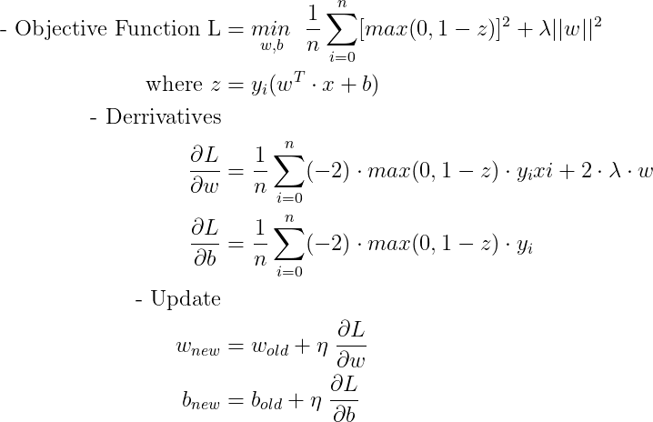
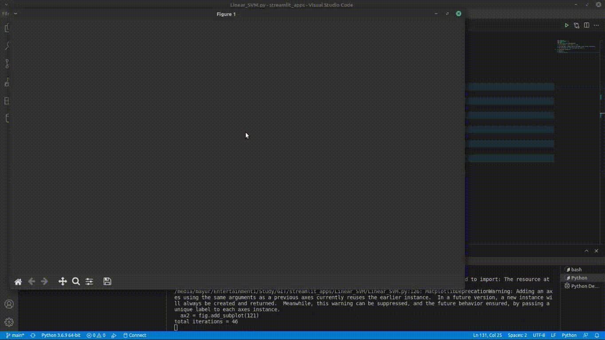

# Linear SVM

Linear SVM or support vector machine is used in classification and regression both. We will implement support vector classifier.
We will be using the squared hinge loss and L2 regularization.

## Formulation

  
- Python file simulation: [Linear_SVM.py](https://github.com/mayurkagathara/streamlit_apps/blob/main/Linear_SVM/Linear_SVM.py)
- Jupyter notebook: [linear_svm.ipynb](https://github.com/mayurkagathara/streamlit_apps/blob/main/Linear_SVM/notebooks/linear_svm.ipynb)
- simulation video: [Linear SVM simulation](https://www.youtube.com/watch?v=0OLhfoOXou8)

