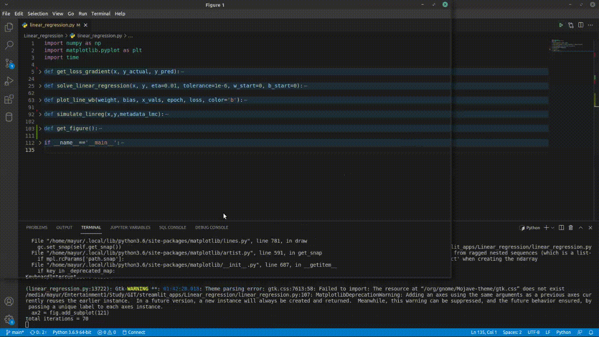
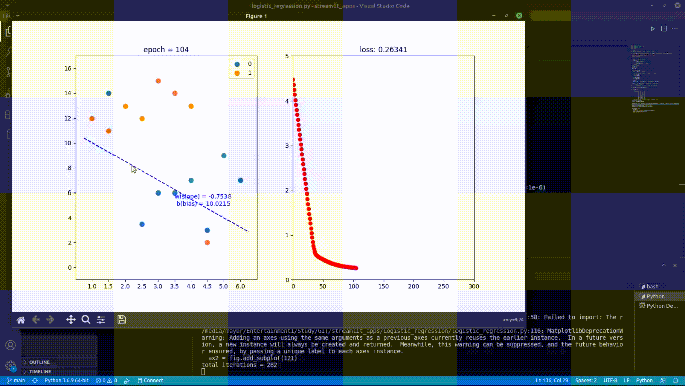

# streamlit_apps

## Machine Learning Algorithm Simulation

This folder is planned to keep all the streamlit projects.  
Currently, simulation is available in standalone python file.  

### Bag of Words

Streamlit app demo

- simulation video: [bag_of_words](https://www.youtube.com/watch?v=iFycxsredRY)

### Linear Regression

- Python file simulation: [linear_regression.py](https://github.com/mayurkagathara/streamlit_apps/blob/main/Linear_regression/linear_regression.py)  
- Jupyter notebook: [linear_regression.ipynb](https://github.com/mayurkagathara/streamlit_apps/blob/main/Linear_regression/notebooks/linear_regression.ipynb)
- Simulation video: [Linear regression simulation](https://www.youtube.com/watch?v=ZspsWFZH8WM)

### Logistic Regression

- Python file simulation: [logistic_regression.py](https://github.com/mayurkagathara/streamlit_apps/blob/main/Logistic_regression/logistic_regression.py)
- Jupyter notebook: [logistic_regression.ipynb](https://github.com/mayurkagathara/streamlit_apps/blob/main/Logistic_regression/notebooks/logistic_regression.ipynb)
- simulation video: [Logistic regression simulation](https://www.youtube.com/watch?v=BUFwhKylyj4)

